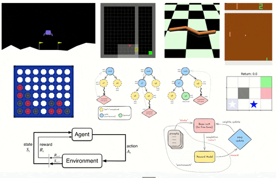

# Deep Reinforcement Learning: Zero to Hero!

[](https://opensource.org/licenses/MIT)
[](https://www.python.org/downloads/release/python-3120/)
[](https://github.com/psf/black)

Welcome to the most hands-on reinforcement learning experience!

This course is a deep dive into the **vast and evolving world of Deep Reinforcement Learning**,
split into two parts. First, you'll learn the foundations of reinforcement learning and master the
classics by building algorithms like **DQN, SAC, and PPO** from the ground up. Then, you'll venture
into advanced topics such as curiosity-driven exploration, **AlphaZero, and RLHF**.

<div style="width: 75%; margin: auto;">
  
</div>

You'll **learn by doing**. This includes everything from playing Atari games, training robots, and
landing on the Moon, to fine-tuning Language Models, implementing self-play with MCTS, and tackling
cutting-edge challenges.

## How it works

You'll progress through a series of hands-on Jupyter notebooks, implementing each algorithm from
scratch in guided `TODO: ...` sections. If you get stuck, don't worry! The `solution` folder has all
the completed notebooks for you to reference.

The entire experience is designed as a one-stop-shop within VS Code, with an opinionated setup so
you can focus on learning, not on boilerplate.

## Quick start

The easiest way to get started is with our Dockerized environment: a full-fledged, reproducible and
ready-to-go development environment!

1.  Install Docker and Git. Clone this repository and `cd` into it.
2.  **On Linux/macOS**, run `printf "UID=$(id -u)\nGID=$(id -g)\n" > .env` to set user permissions.
3.  Run `docker compose up --build -d` and wait for the container to startup. If _poetry_
    installation fails at any point, rerun the command (which will use cached content).
4.  Open your browser to `http://localhost:8080`.
5.  Inside VS Code, select the `drl-env 3.12.11` Python environment.

**Note on GPU:** To enable GPU support (if you have a compatible NVIDIA card and drivers), use this
command instead: `docker compose -f docker-compose.yml -f docker-compose.gpu.yml up --build -d`.

## Chapters

Here is the content and overview of the course:

0.  **Introduction**:An overview of the course and Reinforcement Learning (RL), its core concepts,
    and real-world applications.
1.  **Markov Decision Processes**: The mathematical framework for modeling decision-making in
    uncertain environments.
2.  **Reinforcement Learning Foundations**: Exploring the key components like agents, environments,
    states, actions, and rewards.
3.  **Deep Q Learning**: A value-based algorithm that uses deep neural networks to learn optimal
    actions, famous for mastering Atari games.
4.  **Policy Gradient**: Methods that directly optimize an agent's policy by learning a mapping from
    states to actions.
5.  **Actor Critic Methods**: A hybrid approach combining policy-based (Actor) and value-based
    (Critic) methods for more stable learning.
6.  **Proximal Policy Optimization**: An advanced and very popular policy gradient algorithm that
    improves training stability with clipped updates.
7.  **Bridge to Advanced Topics**: A summary of fundamental concepts and a transition to more
    specialized areas of RL.
8.  **Exploration and Curiosity**: Designing agents that can explore their environment effectively.
9.  **Multi-Agent Reinforcement Learning**: Scenarios where multiple agents interact and learn.
10. **Imitation Learning**: Training agents by having them mimic expert behavior.
11. **Monte Carlo Tree Search & AlphaZero**: The powerful search algorithms behind game-playing
    champions.
12. **Productionizing RL**: Best practices for deploying RL systems in the real world.
13. **Model Based Reinforcement Learning**: Agents that learn a model of the world to plan ahead.
14. **Reinforcement Learning with Human Feedback (RLHF)**: The technique used to align and fine-tune
    modern LLMs.
15. **Conclusion**: A final summary of the course and a look at the future of Reinforcement
    Learning.

## Let's go!

Once your environment is up and running, open the `00_Intro.ipynb` notebook to get started with some
background, prerequisites, and more! Feel also free to take a peek at the notebooks directly on
GitHub to get a sense of the experience.

## Appendix

### Manual Python Environment Setup

For advanced users who prefer a manual setup:

1. Install Miniconda (with Python 3.12).
2. Create and activate the environment:
   ```sh
   conda create --name drlzh python=3.12
   conda activate drlzh
   ```
3. Install Poetry (`pip install poetry`) and project dependencies (`poetry install`).
