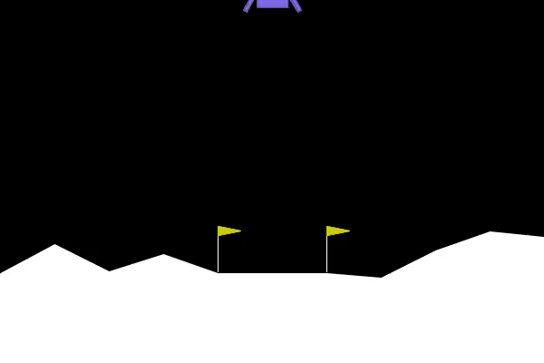

# Deep Reinforcement Learning: Zero to Hero!

Welcome to the most hands-on reinforcement learning experience!

This is a short and practical introductory course on foundational and classic deep reinforcement
learning algorithms. By the end of the course, you will have written from scratch algorithms like
DQN, SAC, PPO, as well as understood at a high-level the theory behind them.

We will be able to train an AI to play Atari games and land on the Moon!

<div style="width: 25%">
  
</div>

## Environment Setup

To make sure we can focus on learning, the environment setup is _opinionated_ 😊 Here it is:

 * Install [Miniconda](https://docs.anaconda.com/free/miniconda/)<br>
   <small>
    Why conda? Because it's a full envinronment manager, and we can choose the Python version too.
   </small>
 * Checkout this Git repository, and `cd` into its folder.
 * Create and activate the `drlzh` virtual environment:
    
    ```sh
    conda create --name drlzh python=3.11
    conda activate drlzh
    ```
 * Install [Poetry](https://python-poetry.org/) and install dependencies:<br>
   <small>
    Dependencies include `gymnasium[accept-rom-license]` for Atari. Make sure to accept the
    license agreement when installing the dependencies of the project via Poetry.
   </small>

   ```
   pip install poetry
   poetry install
   ```
 * Install [Visual Studio Code](https://code.visualstudio.com/)

## How Do I Start?

Open this repository folder in Visual Studio Code (make sure to keep the `.vscode` folder for
settings consistency, running on Jupyter might require some tweaks to code and imports).

Open the first `00_Intro.ipynb` notebook in Visual Studio Code, and follow along! From there, just
keep moving on to the next notebooks. If you get stuck, feel free to check the `/solution` folder.

For an expanded treatment and step-by-step coding, check out the YouTube videos!
